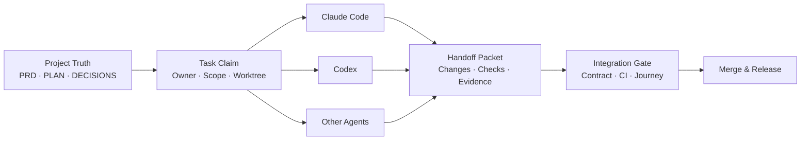

<h1 align="center">
  
  &nbsp;Vibe Coding Handbook for Production Projects
</h1>

<p align="center">
  A production-grade engineering playbook for Claude Code, Codex, and other coding agents.<br>
  It scales from long-running single-agent projects to multi-agent, multi-worktree, and multi-machine delivery.
</p>

<p align="center">
  <a href="README.md">简体中文</a> · <strong>English</strong>
</p>

<p align="center">
  <a href="https://github.com/mountainwind1/Vibecoding-Handbook/releases/latest"></a>
  <a href="https://github.com/mountainwind1/Vibecoding-Handbook/stargazers"></a>
  <a href="https://github.com/mountainwind1/Vibecoding-Handbook/commits/main"></a>
</p>

> Current release: **v7 · Field-Proven** — only field-validated mechanisms stay on the default path: the multi-agent collaboration protocol (task state in the human-readable PLAN.md) is the default and `.vibe/` is demoted to experimental; adds `xreview`, a cross-vendor review gate (send the diff to other vendors' models for read-only reports, with outbound limits enforced mechanically); workflows ship as installable skills (`kof` kick-off / `prog` progress block / `close` closeout gate / `xreview`); project templates live in [templates/](templates/). **Breaking change** — see [MIGRATION-v6-to-v7.md](MIGRATION-v6-to-v7.md) to upgrade from v6.x. The v6 handbook is frozen at v6.2.

## What this is

This is not a collection of prompts for making AI write more code. It is an engineering handbook for delivering real software with coding agents. It connects requirements, design, plans, decisions, task state, code, evidence, and releases into one inspectable and recoverable chain.

It addresses four recurring failure modes:

| Failure mode | Handbook mechanism |
|---|---|
| Features are complete, but the product journey is fragmented | Slice milestones by user journey, then review and accept each slice independently |
| Long sessions lose context and replacement agents must reconstruct the project | Keep project truth in PRD, PLAN, DECISIONS, DESIGN, and related repository files |
| Parallel agents overwrite each other or claim the same work | Ownership, Task Claim, Writable Scope, and Worktree Isolation |
| “Tests passed” is a statement without reproducible proof | Evidence Chain, Deterministic Checks, and Integration / Merge Gates |

## Choose your version

| Version | Best for | State model | Start here |
|---|---|---|---|
| **v5.2 · Single-Agent Solid** | One developer and one Claude Code session on a long-running project | Human-readable documents | [Handbook](Vibe-Coding-正式项目工作手册v5.2.md) · [Release](https://github.com/mountainwind1/Vibecoding-Handbook/releases/tag/v5.2) |
| **v5.3 · Multi-Agent Ready** | Multiple sessions or worktrees, including mixed Claude + Codex development | Human-readable task state in PLAN | [Handbook](Vibe-Coding-正式项目工作手册v5.3.md) · [Release](https://github.com/mountainwind1/Vibecoding-Handbook/releases/tag/v5.3) |
| **v7 · Field-Proven** (latest) | The v5.3 collaboration protocol plus installable skills (kick-off / progress block / closeout gate / cross-vendor review); only field-validated mechanisms stay on the default path | Human-readable task state in PLAN (`.vibe/` demoted to experimental) | [Latest handbook](Vibe-Coding-正式项目工作手册v7.md) · [Release](https://github.com/mountainwind1/Vibecoding-Handbook/releases/tag/v7) · [Upgrade from v6](MIGRATION-v6-to-v7.md) |
| **v6 · Multi-Agent Native** (frozen at v6.2) | Projects that want to experiment with machine-readable task state | Machine-readable state under `.vibe/` (never validated on a real project) | [Handbook](Vibe-Coding-正式项目工作手册v6.md) · [Release](https://github.com/mountainwind1/Vibecoding-Handbook/releases/tag/v6) |

See [VERSION-DIFF.md](VERSION-DIFF.md) for the full comparison.

## The collaboration model



The central rule is simple: **agent runtime may change; project truth must remain in the repository.** Agents may keep temporary memory and tool-specific configuration, but task state, contracts, handoff packets, check results, and integration decisions must never exist only inside a chat session.

## Quick start

1. Choose a version from the table above. New projects should use v7; the v5.2 / v5.3 handbooks remain readable on their own.
2. Copy the templates from [templates/](templates/) into your project root — at least `AGENTS.md`, `ENGINEERING.md`, `CLAUDE.md`, `PRD.md`, `PLAN.md`, `DECISIONS.md`, `CHANGELOG.md`, and `DESIGN.md` — and replace the `{placeholders}`. Then install the directories under [skills/](skills/) as-is into your project's `.claude/skills/` (Codex: `.agents/skills/`), and [agents/security-auditor.md](agents/security-auditor.md) into `.claude/agents/`.
3. Establish project rules and the security baseline in Phase 0, then create the PRD, design system, plan, and decision log.
4. Give every task an Owner, state, worktree, writable scope, definition of done, and verification command. One task = one commit, with a progress block printed after every task. To run tasks back-to-back use the `/kof a` auto-loop: it stops only on its stop conditions (queue done, CI red, a decision is needed, critical task, milestone closeout) and never merges a PR by itself.
5. Before merging, pass the user-journey review, deterministic checks, CI, and the integration gate. Record the resulting milestone and release.

Use this as the opening instruction in a new session:

```text
Read AGENTS.md, ENGINEERING.md, PRD.md, PLAN.md, and DECISIONS.md.
Confirm the current project truth, task owner, writable scope, and integration gate.
Claim exactly one unowned task before starting work.
```

## Repository map

### Handbooks and migrations

| File | Purpose |
|---|---|
| [Vibe-Coding-正式项目工作手册v7.md](Vibe-Coding-正式项目工作手册v7.md) | **Current handbook**: the complete method and execution templates |
| [Vibe-Coding-正式项目工作手册v6.md](Vibe-Coding-正式项目工作手册v6.md) | The v6 handbook (frozen at v6.2) |
| [MIGRATION-v6-to-v7.md](MIGRATION-v6-to-v7.md) | Upgrade from v6.x to v7: template paths, the flipped run-mode declaration, what to do with `.vibe/` |
| [VERSION-DIFF.md](VERSION-DIFF.md) | Selection boundaries for v5.2, v5.3, v6, and v7 |
| [MIGRATION-v5.2-to-v5.3.md](MIGRATION-v5.2-to-v5.3.md) | Upgrade from the stable single-agent workflow to Multi-Agent Ready |
| [MIGRATION-v5.3-to-v6.md](MIGRATION-v5.3-to-v6.md) | Upgrade from human-readable task state to machine-readable state |
| [VIBE-CLI.md](VIBE-CLI.md) | Design draft of the CLI for `.vibe/` (experimental, not implemented) |

### Project templates (all under `templates/`; copy them into your project root)

| File | Purpose |
|---|---|
| [templates/AGENTS.md](templates/AGENTS.md) | Shared entry point for ownership, claims, scope, and handoff rules |
| [templates/ENGINEERING.md](templates/ENGINEERING.md) | Vendor-neutral commands, contracts, CI, branching, and integration rules |
| [templates/CLAUDE.md](templates/CLAUDE.md) | Claude Code adapter; cross-tool rules stay in the shared files above |
| [templates/PRD.md](templates/PRD.md) | Business rules, user journeys, contract pointers, and acceptance criteria |
| [templates/PLAN.md](templates/PLAN.md) | Current milestone, task boundaries, and closure gates |
| [templates/DECISIONS.md](templates/DECISIONS.md) | Append-only architecture and product decision log |
| [templates/DESIGN.md](templates/DESIGN.md) | Single source of truth for the frontend design system |
| [templates/CHANGELOG.md](templates/CHANGELOG.md) | Release and milestone delivery history |
| [templates/SELFCHECK.md](templates/SELFCHECK.md) | Machine-readable self-audit and anti-forgetting protocol for agents |
| [templates/DEPLOY.md](templates/DEPLOY.md) | Deployment playbook: the checklist of defenses that fail silently when misconfigured, plus rollback-drill discipline |
| [templates/OPERATIONS.md](templates/OPERATIONS.md) | Operations notes: runtime behavior you cannot see from the UI |

### Standard Skill

| Skill | Purpose |
|---|---|
| [skills/kof](skills/kof/SKILL.md) | Standard kick-off flow: resume / reload / explicit-task / auto-loop (`/kof a`) modes; prints a progress block after every task; includes the "consult another model" protocol |
| [skills/prog](skills/prog/SKILL.md) | Read-only progress block, three parts by default: **progress** (whole project + current milestone n/m) / **next task** (whether it needs you) / **pending** (`待拍板` decisions and `偏差` deviations); `--full` adds remaining tasks, other open milestones, debt under closed milestones, git and CI health — computed by a script from PLAN + git + gh; `prog.sh` also runs without any AI |
| [skills/close](skills/close/SKILL.md) | Milestone closeout gate: steps 0–7, each producing evidence (re-run historical assertions, journey walkthrough, independent A5 audit, archiving, PR/CI, post-merge checks) |
| [skills/xreview](skills/xreview/SKILL.md) | Cross-vendor review gate: sends the diff to Codex / DeepSeek / GLM for read-only reports, then the lead agent adjudicates (agreement first; single-source findings must be reproduced). Outbound rules are enforced mechanically: diff-only by default, credential files never leave, design docs and password/permission-named files need user authorization naming the recipients, reviewers get no repo access |
| [agents/security-auditor](agents/security-auditor.md) | Subagent definition for the A5 security audit: isolated context, four high-risk patterns, three-part report, re-verification of the full attack chain |

Install: copy the directories under `skills/` **as-is** into your project's `.claude/skills/` (Codex: `.agents/skills/`), and `agents/security-auditor.md` into `.claude/agents/`. Skills hold no project state — root commands and business red lines live in the project's `ENGINEERING.md`; critical-task list, sensitive areas, local environment and traps live in the project's `CLAUDE.md` — so upgrading is a straight overwrite. Usage: `/kof` (resume), `/kof c` (reload after /clear), `/kof M3-T2` (explicit task), `/kof a` (auto-loop), `/prog` (progress), `/close` (closeout).

### Experimental: the `.vibe/` machine-readable state layer (off by default)

Designed in v6 but never used by a real project. To use it, declare it explicitly in your project's `AGENTS.md` run-mode declaration (handbook Appendix C).

- `templates/.vibe/project.json`: persistent project state and scheduling topology.
- `templates/.vibe/tasks/*.json`: executable tasks with owners, scope, dependencies, state, and evidence.
- `templates/.vibe/checks/default.json`: deterministic check definitions.
- `templates/.vibe/.schema/`: JSON Schemas for project and task state.
- `examples/`: task claims, worktrees, handoff packets, and evidence-chain examples.

## Design principles

- **Project truth belongs in the repository.** It must not depend on one model, session, or developer's memory.
- **Field-proven first.** A mechanism that has not been validated on a real project does not go on the default path — `.vibe/` was designed but never used, so v7 demotes it to experimental; the `/kof a` auto-loop, by contrast, was back-ported from a real project.
- **Human-readable documents are the truth.** State lives in PLAN.md; progress is computed from PLAN + git by a script, never stored a second time where it could drift.
- **Integration is a role.** An implementation agent does not unilaterally declare a merge complete; the integration owner verifies cross-task behavior.
- **Evidence before conclusions.** Commands, outputs, commits, pull requests, and journey records form the Evidence Chain.
- **Automation must be deterministic.** The progress block, the outbound guards and the repo self-check are computed by self-tested scripts (`prog.sh`, `xreview.py`, `scripts/check.py`), never paraphrased by a model; they do not replace product judgment or design intent.

## Limits

This workflow raises the delivery floor of AI-assisted projects; it does not make AI infallible. People still own the correctness of requirements, the coherence of the experience, and the acceptance of risk. Stronger automation needs recoverable commits, explicit stopping points, and clear human accountability.

Share field feedback through [Issues](https://github.com/mountainwind1/Vibecoding-Handbook/issues), or download stable editions from [Releases](https://github.com/mountainwind1/Vibecoding-Handbook/releases).
