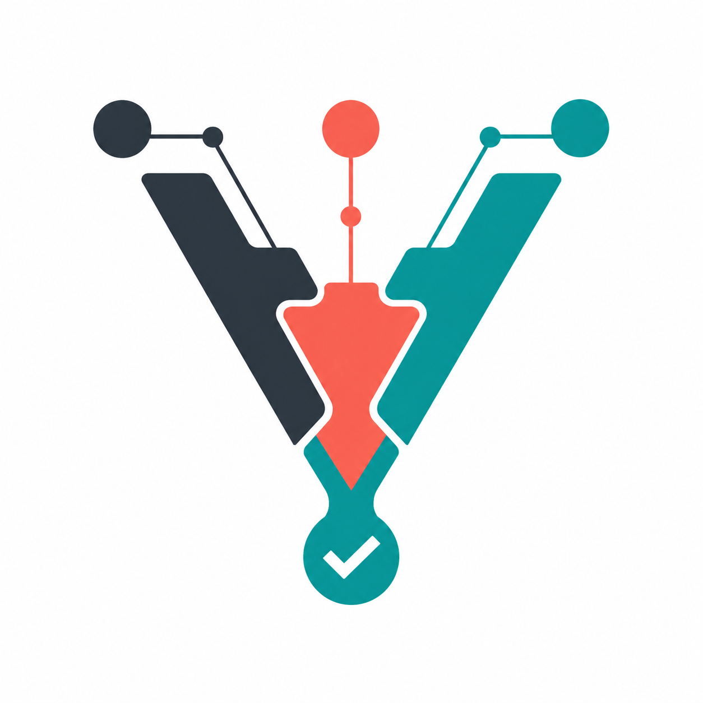
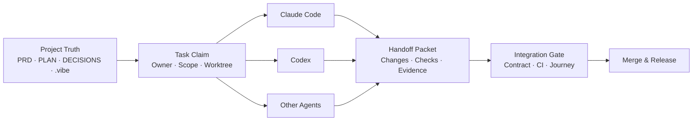

<p align="center">
  
</p>

<h1 align="center">Vibe Coding Handbook for Production Projects</h1>

<p align="center">
  A production-grade engineering playbook for Claude Code, Codex, and other coding agents.<br>
  It scales from long-running single-agent projects to multi-agent, multi-worktree, and multi-machine delivery.
</p>

<p align="center">
  <a href="README.md">简体中文</a> · <strong>English</strong>
</p>

<p align="center">
  <a href="https://github.com/mountainwind1/Vibecoding-Handbook/releases/latest"></a>
  <a href="https://github.com/mountainwind1/Vibecoding-Handbook/stargazers"></a>
  <a href="https://github.com/mountainwind1/Vibecoding-Handbook/commits/main"></a>
</p>

> Current release: **v6 · Multi-Agent Native**. v5.2 and v5.3 remain supported as lower-complexity paths; upgrading is optional.

## What this is

This is not a collection of prompts for making AI write more code. It is an engineering handbook for delivering real software with coding agents. It connects requirements, design, plans, decisions, task state, code, evidence, and releases into one inspectable and recoverable chain.

It addresses four recurring failure modes:

| Failure mode | Handbook mechanism |
|---|---|
| Features are complete, but the product journey is fragmented | Slice milestones by user journey, then review and accept each slice independently |
| Long sessions lose context and replacement agents must reconstruct the project | Keep project truth in PRD, PLAN, DECISIONS, DESIGN, and related repository files |
| Parallel agents overwrite each other or claim the same work | Ownership, Task Claim, Writable Scope, and Worktree Isolation |
| “Tests passed” is a statement without reproducible proof | Evidence Chain, Deterministic Checks, and Integration / Merge Gates |

## Choose your version

| Version | Best for | State model | Start here |
|---|---|---|---|
| **v5.2 · Single-Agent Solid** | One developer and one Claude Code session on a long-running project | Human-readable documents | [Handbook](Vibe-Coding-正式项目工作手册v5.2.md) · [Release](https://github.com/mountainwind1/Vibecoding-Handbook/releases/tag/v5.2) |
| **v5.3 · Multi-Agent Ready** | Multiple sessions or worktrees, including mixed Claude + Codex development | Human-readable task state in PLAN | [Handbook](Vibe-Coding-正式项目工作手册v5.3.md) · [Release](https://github.com/mountainwind1/Vibecoding-Handbook/releases/tag/v5.3) |
| **v6 · Multi-Agent Native** | Long-running parallel work across agents and machines, with automation or scheduling | Machine-readable state under `.vibe/` | [Latest handbook](Vibe-Coding-正式项目工作手册v6.md) · [Release](https://github.com/mountainwind1/Vibecoding-Handbook/releases/tag/v6) |

See [VERSION-DIFF.md](VERSION-DIFF.md) for the full comparison.

## The v6 collaboration model



The central rule is simple: **agent runtime may change; project truth must remain in the repository.** Agents may keep temporary memory and tool-specific configuration, but task state, contracts, handoff packets, check results, and integration decisions must never exist only inside a chat session.

## Quick start

1. Choose a version from the table above. Start with v5.2 for a single-developer project; adopt v5.3 or v6 when parallel work becomes real.
2. Copy the matching templates into your project root. A v6 project should keep at least `AGENTS.md`, `ENGINEERING.md`, `.vibe/`, `PRD.md`, `PLAN.md`, `DECISIONS.md`, `CHANGELOG.md`, and `DESIGN.md`.
3. Establish project rules and the security baseline in Phase 0, then create the PRD, design system, plan, and decision log.
4. Give every task an Owner, state, worktree, writable scope, definition of done, and verification command. Keep one session focused on one task or one homogeneous batch.
5. Before merging, pass the user-journey review, deterministic checks, CI, and the integration gate. Record the resulting milestone and release.

Use this as the opening instruction in a new session:

```text
Read AGENTS.md, ENGINEERING.md, PRD.md, PLAN.md, DECISIONS.md, SELFCHECK.md, and .vibe/.
Confirm the current project truth, task owner, writable scope, and integration gate.
Claim exactly one unowned task before starting work.
```

## Repository map

### Handbooks and migrations

| File | Purpose |
|---|---|
| [Vibe-Coding-正式项目工作手册v6.md](Vibe-Coding-正式项目工作手册v6.md) | Complete v6 method and execution templates |
| [VERSION-DIFF.md](VERSION-DIFF.md) | Selection boundaries for v5.2, v5.3, and v6 |
| [MIGRATION-v5.2-to-v5.3.md](MIGRATION-v5.2-to-v5.3.md) | Upgrade from the stable single-agent workflow to Multi-Agent Ready |
| [MIGRATION-v5.3-to-v6.md](MIGRATION-v5.3-to-v6.md) | Upgrade from human-readable task state to machine-readable state |
| [VIBE-CLI.md](VIBE-CLI.md) | CLI design for v6 task state, deterministic checks, and integration gates |

### Project-truth templates

| File | Purpose |
|---|---|
| [AGENTS.md](AGENTS.md) | Shared entry point for ownership, claims, scope, and handoff rules |
| [ENGINEERING.md](ENGINEERING.md) | Vendor-neutral commands, contracts, CI, branching, and integration rules |
| [CLAUDE.md](CLAUDE.md) | Claude Code adapter; cross-tool rules stay in the shared files above |
| [PRD.md](PRD.md) | Business rules, user journeys, contract pointers, and acceptance criteria |
| [PLAN.md](PLAN.md) | Current milestone, task boundaries, and closure gates |
| [DECISIONS.md](DECISIONS.md) | Append-only architecture and product decision log |
| [DESIGN.md](DESIGN.md) | Single source of truth for the frontend design system |
| [CHANGELOG.md](CHANGELOG.md) | Release and milestone delivery history |
| [SELFCHECK.md](SELFCHECK.md) | Machine-readable self-audit and anti-forgetting protocol for agents |

### Multi-Agent Native

- `.vibe/project.json`: persistent project state and scheduling topology.
- `.vibe/tasks/*.json`: executable tasks with owners, scope, dependencies, state, and evidence.
- `.vibe/checks/default.json`: deterministic check definitions.
- `.vibe/.schema/`: JSON Schemas for project and task state.
- `examples/`: task claims, worktrees, handoff packets, and evidence-chain examples.

## Design principles

- **Project truth belongs in the repository.** It must not depend on one model, session, or developer's memory.
- **Compatibility first.** v6 is an optional coordination layer; it does not invalidate the stable v5.2 workflow.
- **Readable by humans and machines.** Markdown stays discussable, while `.vibe/` makes state validatable and schedulable.
- **Integration is a role.** An implementation agent does not unilaterally declare a merge complete; the integration owner verifies cross-task behavior.
- **Evidence before conclusions.** Commands, outputs, commits, pull requests, and journey records form the Evidence Chain.
- **Automation must be deterministic.** The CLI manages state transitions and gates, not product judgment or design intent.

## Limits

This workflow raises the delivery floor of AI-assisted projects; it does not make AI infallible. People still own the correctness of requirements, the coherence of the experience, and the acceptance of risk. Stronger automation needs recoverable commits, explicit stopping points, and clear human accountability.

Share field feedback through [Issues](https://github.com/mountainwind1/Vibecoding-Handbook/issues), or download stable editions from [Releases](https://github.com/mountainwind1/Vibecoding-Handbook/releases).
