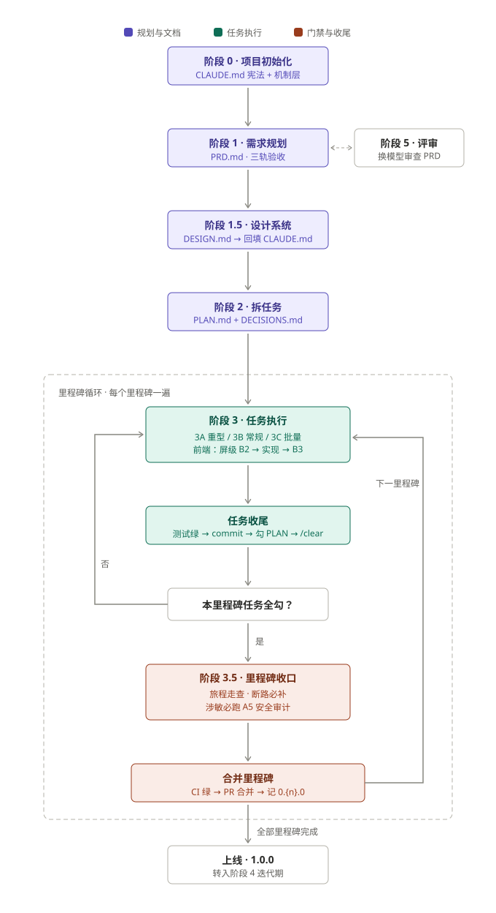
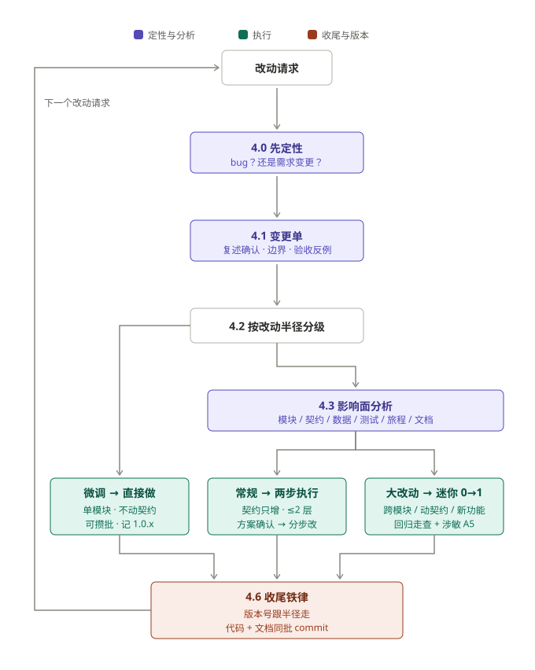

# Vibe Coding 正式项目工作手册

> 一套面向 Claude Code 的正式项目开发工作流（v5.1）：**垂直切片 + 任务分档 + 门禁收口 + 机制优先**。
> 目标：让"AI 写代码"的项目做出来是一个连贯的产品，而不是一堆正确的零件。

## 解决什么问题

- **两张皮**：功能都做完了，产品却像 demo——页面之间断头、用户不知道下一步。根因是按"技术层"推进（先做完后端再做前端）。本手册把里程碑改为按"用户能完成的垂直切片"切，每个里程碑收口强制以新用户身份走一遍完整旅程，脱节在当下暴露，不会攒到最后爆发。
- **上下文与成本失控**：一个会话吃下整个项目、所有任务全程最高规格思考。本手册用"文档接力棒"（七个文件各司其职，会话 `/clear` 后靠读文件恢复全部上下文）+ 任务三档分级（重型/常规/轻型各配专用执行模板和模型档位）控制。
- **纪律靠嘴**：CI 红着合并、密钥进仓库、危险命令误执行——写在文档里的纪律会在长会话尾部失效。本手册把能机制化的规则全部机制化（permissions 硬拦截、pre-commit 密钥扫描、CI 安全步骤、评审走子代理），纪律只做兜底。
- **安全无门禁**：涉敏里程碑（鉴权/支付/PII/文件上传/用户输入入库）收口强制安全审计，高危清零才能合并——安全和产品连贯性一样是强制门禁，不是"按需选用"。

## 仓库结构

| 文件 | 作用 |
|------|------|
| [Vibe-Coding-正式项目工作手册v5.1.md](Vibe-Coding-正式项目工作手册v5.1.md) | 手册本体：阶段 0→4 全流程（含 Phase 模式、文档规模化护栏）、9 条实战护栏、附录 A/B 角色提示词与支付集成检查单（入口是文末"一页速查"） |
| [CLAUDE.md](CLAUDE.md) | 项目宪法模板：TIER 1 硬规则 / TIER 2 工作方式 / 易错点，每个会话自动读入 |
| [PRD.md](PRD.md) | 活的需求规格模板：业务规则 + 数据契约指针 + 产品体验四件套 + 三轨验收 |
| [PLAN.md](PLAN.md) | 任务接力棒模板：垂直切片里程碑 + 档位/执行模式标注 + 收口验收门 |
| [DECISIONS.md](DECISIONS.md) | 决策日志模板：只增不改，普通决策 + 伏笔（延后/预留）两种格式 |
| [CHANGELOG.md](CHANGELOG.md) | 版本日志模板：版本号 ↔ 里程碑映射（M0=0.1.0，上线=1.0.0） |
| [DESIGN.md](DESIGN.md) | 设计系统模板：前端视觉的单一真相，禁止组件内硬编码颜色/间距/字号 |
| [SELFCHECK.md](SELFCHECK.md) | 大模型自查手册（机读版）：新会话开场读入，自动判定阶段、体检门禁、输出诊断报告；内置防遗忘协议（段标回显 + 强制规则 ID 引用） |
| `assets/` | 下面两张执行流程图 |

## 执行流程

**建设期（0→1）**：文档接力棒依次就绪后进入里程碑循环，两道门禁（旅程走查、CI 绿合并）卡在每次出循环的必经之路上。



**上线后（阶段 4 迭代）**：所有改动先定性、再按改动半径分流——微调走最短路，大改动走"迷你 0→1"复用建设期全部机制，没有第二套规则。



## 快速开始（新项目五步）

1. 把七个模板文件复制进你的新项目目录。
2. 按手册**阶段 0** 的提示词生成项目宪法，同时立机制层：`.claude/settings.json` 危险命令 permissions、pre-commit 密钥扫描、CI 加 secret 扫描 + 依赖审计（属 M0 的 DoD）。
3. **阶段 1 → 1.5 → 2** 依次产出 PRD / DESIGN / PLAN+DECISIONS，中间用**阶段 5** 换模型评审 PRD（输出评审报告、增量回填，不整文件重写）。
4. 进入里程碑循环：每个会话按 PLAN 里任务的档位选 **3A 重型 / 3B 常规 / 3C 批量**模板执行，做完 commit + 勾选 + `/clear`。
5. 每个里程碑收口：旅程走查（断路必补）+（涉敏）A5 安全审计 + CI 绿 + PR 合并 + CHANGELOG 记 `0.{n}.0`。

## 第二种用法：审核既有项目

手册的每条规则都是留痕的门禁，所以它同时是一份审计标准。按五层证据链查：**文档一致性 → git 纪律 → 门禁留痕 → 机制配置 → 产品实走**。前四层可以让 AI 跑（新会话粘贴下面的提示词），第五层必须人以新用户身份走一遍旅程。

日常轻量版：每次开新会话或阶段性任务时，第一句 `读 SELFCHECK.md` ——AI 会自动判定当前阶段、逐条体检硬规则与门禁、给出补救处方和本会话计划；报告末尾必须回显全部段标（M0–M9）并给出规则引用数，缺回显 = 手册被截断或被忽略，要求它重读。

```
读 Vibe-Coding-正式项目工作手册v5.1.md，把它当作审计标准，对本项目的执行过程做合规审核。
只读不改。逐层检查并给出证据（文件:行 / commit hash / PR 链接）：
1. 文档层：七个配套文件是否存在、是否各司其职（对照手册"文档分工"表）；PRD 是否保持
   当前真相、PLAN 是否只装未做任务、DECISIONS/CHANGELOG 是否只增不改、契约是否
   单一真相在 shared 包。
2. git 层：是否一任务一 commit、有无直推 main、上一里程碑全部 commit 是否已进 main、
   有无 CI 红着合并的 PR。
3. 门禁层：每个已收口里程碑是否有旅程走查记录、CHANGELOG 版本条目、CI 绿证据；
   涉敏里程碑是否有 A5 审计留痕。
4. 机制层：permissions / pre-commit / CI 安全步骤是否实际配置，还是只停留在文档纪律。
输出：按 违规（必须整改）> 缺失留痕（补记）> 建议 三级排序的审核报告，
每条注明违反手册哪一节。不要为了报告好看而遗漏问题。
```

## 边界与原则

- 这套流程提高的是模型写代码的**下限**（错误更少），不是让 AI 无所不能；它的价值建立在"你能判断 AI 做得对不对"之上。
- 自动化越强，越要给它回滚点（git commit）和停止点（改一轮就停下让你看），而不是放它无监督长跑。
- 上下文是有限资源：一个会话只做一个任务（或一批可批量任务），靠文档 + git 接力，而不是靠会话记忆。
- 手册面向单人 + Claude Code 的开发形态；多人协作时分支保护、人工 code review 等机制需另行补强。
