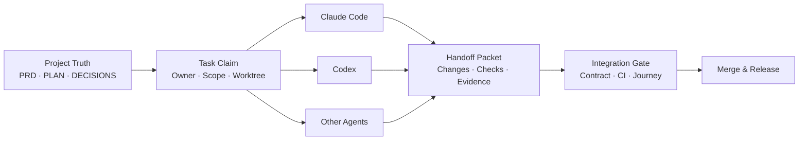

<h1 align="center">
  
  &nbsp;Vibe Coding 正式项目工作手册
</h1>

<p align="center">
  面向 Claude Code、Codex 与其他编程 Agent 的正式项目工程方法。<br>
  从单 Agent 长期开发，到多 Agent、多 Worktree、异构模型互相复核，都有清晰的项目真相、执行边界与交付门禁。
</p>

<p align="center">
  <strong>简体中文</strong> · <a href="README.en.md">English</a>
</p>

<p align="center">
  <a href="https://github.com/mountainwind1/Vibecoding-Handbook/releases/latest"></a>
  <a href="https://github.com/mountainwind1/Vibecoding-Handbook/stargazers"></a>
  <a href="https://github.com/mountainwind1/Vibecoding-Handbook/commits/main"></a>
</p>

> 当前最新版：**v7 · Field-Proven**——默认路径只留被真实项目验证过的机制：多 Agent 协作协议（任务状态在人读的 PLAN.md）为默认、`.vibe/` 降为实验；新增 `xreview` 异构模型复核门（把 diff 发给别家模型各出一份只读报告，外发限制机制化）；流程以可安装的 skill 交付（`kof` 开工 / `prog` 进度块 / `close` 收口门 / `xreview`）；项目模板在 [templates/](templates/)。**破坏性变更**，从 v6.x 升级见 [MIGRATION-v6-to-v7.md](MIGRATION-v6-to-v7.md)。v6 手册冻结于 v6.2。

## 这是什么

这不是一套让 AI “多写代码”的提示词，而是一套让 AI 参与正式软件交付的工程手册。它把需求、设计、计划、决策、任务状态、代码、证据与发布连接成一条可检查、可恢复、可交接的链路。

它重点解决四类问题：

| 常见问题 | 手册给出的机制 |
|---|---|
| 功能都完成了，产品旅程却是断的 | 按用户旅程切垂直里程碑，每个里程碑独立走查与验收 |
| 长会话丢上下文，换 Agent 后重新猜项目 | 用 PRD、PLAN、DECISIONS、DESIGN 等文件保存项目真相 |
| 多个 Agent 同时修改，互相覆盖或抢任务 | Ownership、Task Claim、Writable Scope、Worktree Isolation |
| “测试过了”只有一句话，没有可复核证据 | Evidence Chain、Deterministic Checks、Integration / Merge Gate |

## 选择适合你的版本

| 版本 | 适用场景 | 状态模型 | 入口 |
|---|---|---|---|
| **v5.2 · Single-Agent Solid** | 单人 + 单个 Claude Code 会话，长期正式项目 | 人读文档 | [手册](Vibe-Coding-正式项目工作手册v5.2.md) · [发布版](https://github.com/mountainwind1/Vibecoding-Handbook/releases/tag/v5.2) |
| **v5.3 · Multi-Agent Ready** | 多会话 / 多 Worktree，或 Claude + Codex 混合开发 | PLAN 中的人读任务状态 | [手册](Vibe-Coding-正式项目工作手册v5.3.md) · [发布版](https://github.com/mountainwind1/Vibecoding-Handbook/releases/tag/v5.3) |
| **v7 · Field-Proven**（最新） | v5.3 的协作协议 + 可安装的 skill（开工 / 进度块 / 收口门 / 异构复核）；默认路径只留被真实项目验证过的机制 | PLAN 中的人读任务状态（`.vibe/` 降为实验） | [最新手册](Vibe-Coding-正式项目工作手册v7.md) · [发布版](https://github.com/mountainwind1/Vibecoding-Handbook/releases/tag/v7) · [从 v6 升级](MIGRATION-v6-to-v7.md) |
| **v6 · Multi-Agent Native**（冻结于 v6.2） | 想试验机器可读任务状态的项目 | `.vibe/` 机器可读项目状态（未经真实项目验证） | [手册](Vibe-Coding-正式项目工作手册v6.md) · [发布版](https://github.com/mountainwind1/Vibecoding-Handbook/releases/tag/v6) |

完整差异见 [VERSION-DIFF.md](VERSION-DIFF.md)。

## 协作模型



核心原则是：**Agent runtime 可以更换，project truth 必须留在仓库里。** Agent 可以拥有自己的临时记忆和工具配置，但任务状态、契约、交接包、检查结果与集成结论不能只存在于某个会话中。

## 快速开始

1. 根据上表选择版本。新项目直接用 v7；v5.2 / v5.3 的手册仍可单独阅读。
2. 把 [templates/](templates/) 里的模板复制到项目根目录：至少 `AGENTS.md`、`ENGINEERING.md`、`CLAUDE.md`、`PRD.md`、`PLAN.md`、`DECISIONS.md`、`CHANGELOG.md` 与 `DESIGN.md`，把 `{占位}` 换成项目的实际内容。再把 [skills/](skills/) 下的目录原样装进项目的 `.claude/skills/`（Codex：`.agents/skills/`），[agents/security-auditor.md](agents/security-auditor.md) 装进 `.claude/agents/`。
3. 先完成阶段 0 的规则和安全基线，再依次建立 PRD、设计系统、计划与决策日志。
4. 每个任务明确 Owner、状态、Worktree、可写范围、完成定义和验证命令；一任务一 commit，每个任务收尾输出进度块；想连做用 `/kof a` 自动循环，它命中停止条件（队列做完、CI 红、需要拍板、命门、收口）才停，且永不自动合并 PR。
5. 每个里程碑必须通过用户旅程走查、确定性检查、CI 和集成门禁，之后再合并与记录版本。

新会话可从这句开始：

```text
读取 AGENTS.md、ENGINEERING.md、PRD.md、PLAN.md、DECISIONS.md，
确认当前项目真相、任务 Owner、可写范围与集成门禁；只认领一个未被占用的任务再开始工作。
```

## 仓库内容

### 主手册与迁移

| 文件 | 作用 |
|---|---|
| [Vibe-Coding-正式项目工作手册v7.md](Vibe-Coding-正式项目工作手册v7.md) | **当前主手册**：完整方法与执行模板 |
| [Vibe-Coding-正式项目工作手册v6.md](Vibe-Coding-正式项目工作手册v6.md) | v6 手册（冻结于 v6.2） |
| [MIGRATION-v6-to-v7.md](MIGRATION-v6-to-v7.md) | 从 v6.x 升级到 v7：模板路径、运行模式声明方向翻转、`.vibe/` 去留 |
| [VERSION-DIFF.md](VERSION-DIFF.md) | v5.2 / v5.3 / v6 的选型边界 |
| [MIGRATION-v5.2-to-v5.3.md](MIGRATION-v5.2-to-v5.3.md) | 从单 Agent 稳定模式升级到 Multi-Agent Ready |
| [MIGRATION-v5.3-to-v6.md](MIGRATION-v5.3-to-v6.md) | 从人读任务状态升级到机器可读状态 |
| [VIBE-CLI.md](VIBE-CLI.md) | `.vibe/` 配套 CLI 的设计草案（实验，未实现） |

### 项目模板（都在 `templates/`，复制到你的项目根目录用）

| 文件 | 作用 |
|---|---|
| [templates/AGENTS.md](templates/AGENTS.md) | 所有 Agent 的通用入口、Ownership、Claim、Scope 与 Handoff 规则 |
| [templates/ENGINEERING.md](templates/ENGINEERING.md) | 与厂商无关的命令、契约、CI、分支和集成规则 |
| [templates/CLAUDE.md](templates/CLAUDE.md) | Claude Code 适配层；跨工具规则仍以上述通用文件为准 |
| [templates/PRD.md](templates/PRD.md) | 业务规则、用户旅程、契约指针与验收标准 |
| [templates/PLAN.md](templates/PLAN.md) | 当前里程碑、任务边界与收口门禁 |
| [templates/DECISIONS.md](templates/DECISIONS.md) | 只增不改的架构与产品决策日志 |
| [templates/DESIGN.md](templates/DESIGN.md) | 前端设计系统的单一真相 |
| [templates/CHANGELOG.md](templates/CHANGELOG.md) | 版本与里程碑交付记录 |
| [templates/SELFCHECK.md](templates/SELFCHECK.md) | 面向大模型的机读自查与防遗忘协议 |
| [templates/DEPLOY.md](templates/DEPLOY.md) | 部署手册：「配错时不报错」的防线清单与回滚演练 |
| [templates/OPERATIONS.md](templates/OPERATIONS.md) | 运维备忘：运行期「界面上看不出来」的行为 |

### 标准 Skill

| Skill | 作用 |
|---|---|
| [skills/kof](skills/kof/SKILL.md) | 标准开工流程（kick-off）：续接 / 重载 / 指定任务 / 自动循环（`/kof a`）四模式；每任务收尾输出进度块；含"找另一个模型讨论"规程 |
| [skills/prog](skills/prog/SKILL.md) | 只读项目进度块，默认只有三段：**进度**（项目总体 + 当前里程碑 n/m）/ **下一步**（要不要人到场）/ **待处理**（「待拍板 / 偏差」）；`--full` 追加距收口、其他在途、挂账、git 与 CI 健康——由脚本从 PLAN + git + gh 现算，也可不经 AI 直接跑 `prog.sh` |
| [skills/close](skills/close/SKILL.md) | 里程碑收口验收门：0–7 步逐步出证据（历史断言重跑、旅程走查、独立 A5、归档、PR/CI、合并后核对） |
| [skills/xreview](skills/xreview/SKILL.md) | 异构模型复核门：把 diff 发给 Codex / DeepSeek / GLM 各出一份只读报告，主控合并裁决（多方同报优先、独报先复现）。外发规则机制化：默认只发 diff、凭证永不发、设计文档与口令·权限类文件须用户授权并点名接收方、评审方拿不到仓库 |
| [agents/security-auditor](agents/security-auditor.md) | A5 安全审计的子代理定义：上下文隔离、四类高危模式、三段式报告、原手法复验整条攻击链 |

安装：把 `skills/` 下的目录**原样**复制到项目的 `.claude/skills/`（Codex：`.agents/skills/`），`agents/security-auditor.md` 复制到 `.claude/agents/`。skill 里不放项目状态——根命令与业务红线写在项目的 `ENGINEERING.md`，命门 / 涉敏点 / 本机环境 / 踩过的坑写在项目的 `CLAUDE.md`，所以手册升级时直接覆盖即可。用法：`/kof`（续接）、`/kof c`（/clear 后重载）、`/kof M3-T2`（指定任务）、`/kof a`（自动循环）、`/prog`（看进度）、`/close`（收口）。

### 实验：`.vibe/` 机器可读状态层（默认不启用）

设计于 v6，但没有真实项目用过；要用须在项目 `AGENTS.md` 的「运行模式声明」里显式声明（手册附录 C）。

- `templates/.vibe/project.json`：持久化项目状态与调度拓扑。
- `templates/.vibe/tasks/*.json`：机器可执行的任务、Owner、Scope、依赖、状态与证据。
- `templates/.vibe/checks/default.json`：确定性检查集合。
- `templates/.vibe/.schema/`：项目和任务状态的 JSON Schema。
- `examples/`：任务认领、Worktree、交接包和证据链示例。

## 设计原则

- **项目真相属于仓库**：不依赖某个模型、会话或开发者的记忆。
- **实证优先**：没有在真实项目里验证过的机制不进默认路径——`.vibe/` 设计了、没人用过，v7 把它降为实验；`/kof a` 自动循环则是从真实项目里回填上来的。
- **人读文档是真相**：状态写在 PLAN.md；进度由脚本从 PLAN + git 现算，不另存一份会漂移的状态。
- **集成是一种角色**：实现 Agent 不能自行宣布合并完成，集成负责人负责跨任务验证。
- **证据先于结论**：命令、输出、提交、PR 与旅程记录组成 Evidence Chain。
- **自动化必须确定**：进度块、外发守卫、仓库自检都由带自检的脚本算出（`prog.sh`、`xreview.py`、`scripts/check.py`），不经模型转述；它们不替代 PRD、设计与业务判断。

## 使用边界

这套方法提高的是 AI 编程项目的交付下限，不是让 AI 无所不能。你仍然需要判断需求是否正确、体验是否连贯、风险是否可接受。自动化越强，越要保留可回滚的提交、明确的停止点和最终的人类责任。

欢迎通过 [Issues](https://github.com/mountainwind1/Vibecoding-Handbook/issues) 提交实战反馈，通过 [Releases](https://github.com/mountainwind1/Vibecoding-Handbook/releases) 下载各稳定版本。
